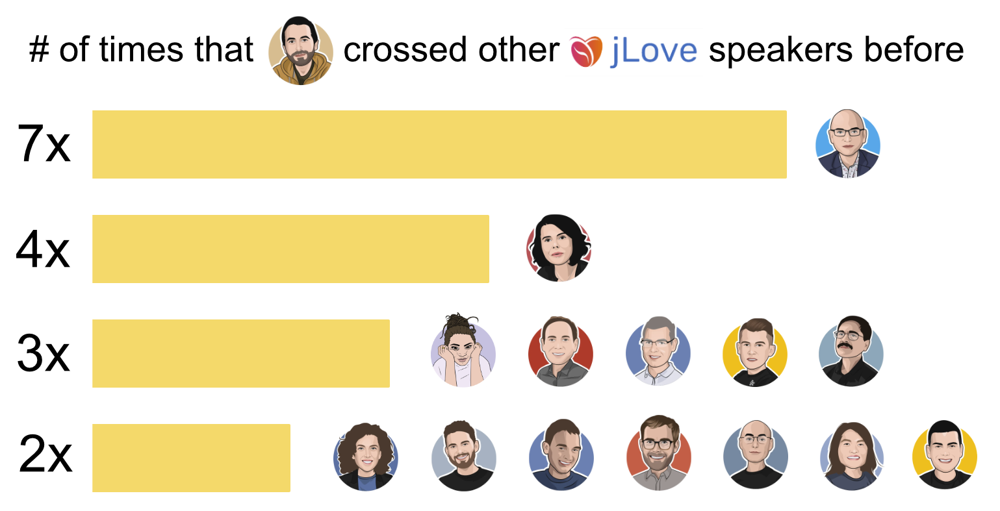

# Speaker Together

Most conferences [I spoke at in 2020](https://ticofab.io/talks/) were remote,
and it looks like this trend is not reversing anytime soon. One of the
things I miss the most about the IRL events are the speaker dinners.

While looking at the [JLove 2020](https://jlove.konfy.care/) speakers,
I wondered how many of them I "crossed" at previous conferences, maybe 
without even realizing. So I sat down, collected data from all the events
that I spoke at before and wrote this little scripty app to crunch the (tiny) numbers.

For instance, this is how many past speaking events I have in common with other speakers of JLove 2020:

## Evolution of this project

I am going to update these stats as my speaking data grows.

While I don't plan to make this more complex than it is now, if other folks find this
interesting, we could work together and expand both dataset and functionality.

## Speakers at the same event as myself (at least twice)

Please open a PR if you want your account linked here (or if you would like your name removed).

| Name | Events in common |
| :--- | :--------------- |
| [Adam Sandor](https://twitter.com/adamsand0r) | 8 |
| Jon Pretty | 7 |
| Justin Kaeser | 5 |
| Hugh McKee | 5 |
| [Alessandro Vozza](https://twitter.com/bongo) | 4 |
| Jacek Kunicki | 4 |
| Renato Cavalcanti | 4 |
| Holly Cummins | 4 |
| Yan Cui | 4 |
| Sander Hoogendoorn | 3 |
| Philipp Krenn | 3 |
| Robin Moffatt | 3 |
| Melanie Rieback | 3 |
| Adam Fraser | 3 |
| Tomasz Godzik | 3 |
| Jason Yee | 3 |
| Sébastien Doeraene | 3 |
| [Wiem Zine Elabidine](https://twitter.com/WiemZin) | 3 |
| Thiago de Faria | 3 |
| Venkat Subramaniam | 3 |
| Alessandro Confetti | 3 |
| Mark Heckler | 3 |
| James Thomas | 3 |
| [Nicolas Rinaudo](https://twitter.com/NicolasRinaudo) | 3 |
| Liz Rice | 3 |
| Daniela Sfregola | 3 |
| Stéphane Tankoua | 3 |
| Jettro Coenradie | 3 |
| Eugene Yokota | 3 |
| Jarek Ratajski | 3 |
| Alessandro (cirpo) Cinelli | 3 |
| Krzysztof Romanowski | 3 |
| Adam Warski | 3 |
| Oli Makhasoeva | 3 |
| Daniel Gebler | 3 |
| Viktor Gamov | 3 |
| Mikhail Mutcianko | 3 |
| Nicolas Frankel | 3 |
| Armagan Amcalar | 2 |
| Erik Veld | 2 |
| Alex Soto | 2 |
| Jakub Kozłowski | 2 |
| Omosola Odetunde | 2 |
| Ivan Jovanovic | 2 |
| Bruno Bossola | 2 |
| Grzegorz Gawron | 2 |
| Jamie Allen | 2 |
| Mete Atamel | 2 |
| Annarita De Biase | 2 |
| Christophe Calvès | 2 |
| Max Gallo | 2 |
| Martin Odersky | 2 |
| John Stevenson | 2 |
| Iulian Dragoș | 2 |
| Danilo Poccia | 2 |
| Vincent de Haan | 2 |
| Kenny Baas | 2 |
| Jeferson David Ossa | 2 |
| Roksolana Diachuk | 2 |
| Gabriele Petronella | 2 |
| Matteo Collina | 2 |
| Matthew Opala | 2 |
| Vladik Khononov | 2 |
| Bernd Rücker | 2 |
| Nikhil Barthwal | 2 |
| Yifan Xing | 2 |
| Alex Fernández | 2 |
| Kim van Wilgen | 2 |
| Kévin Rauscher | 2 |
| [Pierangelo Cecchetto](https://twitter.com/pierangelocecc) | 2 |
| Juliette Reinders Folmer | 2 |
| Łukasz Biały | 2 |
| Alexander Podkhalyuzin | 2 |
| Dennis Traub | 2 |
| Paulo Lopes | 2 |
| Luka Jacobowitz | 2 |
| Mata Haggis | 2 |
| Anne Currie | 2 |
| Kai Waehner | 2 |
| Wojtek Pituła | 2 |
| Nick Tune | 2 |
| Andres Almiray | 2 |
| Cristiano Rastelli | 2 |
| Dennis van der Bij | 2 |
| Jörg Schad | 2 |
| Bruce Lawson | 2 |
| Stève Sfartz | 2 |
| Francois Laroche | 2 |
| Ricardo Ferreira | 2 |
| Cornelia Davis | 2 |
| Marcin Rzeźnicki | 2 |
| John De Goes | 2 |
| Michał Jakóbczyk | 2 |
| Anuraag Verma | 2 |
| Hadi Hariri | 2 |
| Ruslan Shevchenko | 2 |
| Mary Grygleski | 2 |
| Natan Silnitsky | 2 |
| Mike Amundsen | 2 |
| Sergey Bykov | 2 |
| Pieter Lange | 2 |
| Rossella De Gaetano | 2 |
| Tugdual Grall | 2 |
| Lauren Schaefer | 2 |
| Roman Ivanov | 2 |
| Paweł Rzeszuciński | 2 |
| Ivan Topolnjak | 2 |
| Bert Jan Schrijver | 2 |
| Guillaume Martres | 2 |
| Avinash Changa | 2 |
| Rory Graves | 2 |
| Sjoerd Mulder | 2 |
| Matt Jarvis | 2 |
| Manuel Bernhardt | 2 |
| Dave Lewis | 2 |
| James Ward | 2 |
| Eric Loots | 2 |
| Trisha Gee | 2 |
| Joost Heijkoop | 2 |
| Paweł Kamiński | 2 |
| Ayush Mittal | 2 |
| Maria Gómez | 2 |
| Phil Nash | 2 |
| Mike Chernev | 2 |
| Oleh Dokuka | 2 |
| Mateusz Ziarko | 2 |
| Matteo Valoriani | 2 |
| Artur Skowroński | 2 |
| Li Haoyi | 2 |
| Sasha Romijn | 2 |
| Bart Enkelaar | 2 |
| Sebastian Porsdam Mann | 2 |
| Zainab Ali | 2 |
| Roel Ezendam | 2 |
| Hugo Sousa | 2 |
| Jacek Leśkow | 2 |
| Nikolay Tsvetkov | 2 |

## License

    Copyright 2020 Fabio Tiriticco - Fabway

    Licensed under the Apache License, Version 2.0 (the "License");
    you may not use this file except in compliance with the License.
    You may obtain a copy of the License at

       http://www.apache.org/licenses/LICENSE-2.0

    Unless required by applicable law or agreed to in writing, software
    distributed under the License is distributed on an "AS IS" BASIS,
    WITHOUT WARRANTIES OR CONDITIONS OF ANY KIND, either express or implied.
    See the License for the specific language governing permissions and
    limitations under the License.
 
